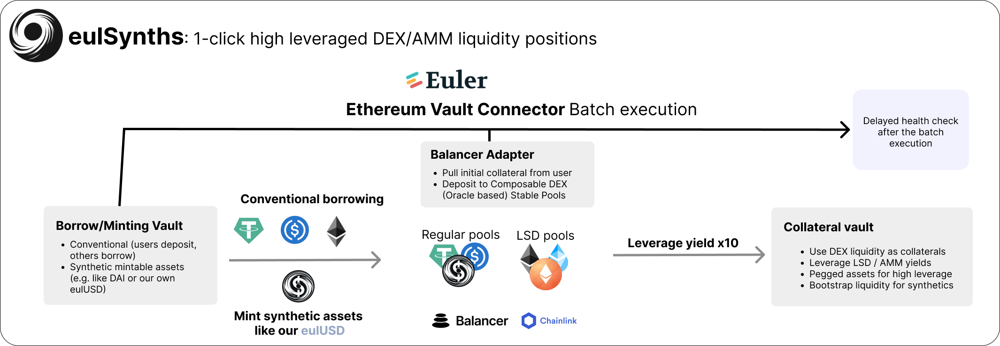

# eulSynth - Single click leveraged DEX LP

## Tagline

eulSynths is a universal DeFi yield product platform built on Euler and Balancer.

The protocol allows users to leverage DEX liquidity from protocols like Balancer to multiply their intrinsic yield. This has applications across multiple domains:

- On top of LSD yields, they can also leverage their DEX yield exposure
- The architecture allows for native miniting of synthetic assets together with direct liquidity bootstrapping via Balacner Composed Stable Pools
- All of this is enabled by Euler's Ethereum Vault Connector - the batch and deferred health check allows for single click execution of leveraged AMM pools 

## What problems do we solve

Getting optimal yield has been very duifficult in the past. A multitude of synthetic assets and derivatives (especially LSDs) allow for multiple variations of generating income.

One could either add it to DEX pools to earn fees on the high volumes or just leverage them up on lending protocol.
eulSynth is the first protocol that allows for flexible and dynamic onboarding of DEX liquidity.

## Challenges

Balancer and Euler are both highly composable protocols, however, their composability comes with a high degree of complexity.

Balancer for instance allowed us to select from a multitude of Stable Pools, each of which have highly specific parametrizations. On top of that, Euler's implementation of the Vault Connector is ebntirely new, as such, we had to take a long time to even just understand how we could make them work together.

## Technologies 

- Synthetic assets enabled by ChainLink's price feeds
- Balancer's Composable Stable Pools (which are also oracle-based)
- Euler's Ethereum Vault Connector that allows for flexible batching and single-click leveraged Balancer DEX liquidity provision

## Contracts

| Contract    | Address |
| -------- | ------- |
| BalancerAdapterSepolia  | `0x3046ff18D6D0726BC9711E29DAE3A20F7C33de98`    |
| 3USD plus eulUSD CSP| `0x5a9676311a41e8acae9e2f46c1b5c4a304c38736`|
| VaultCollateral | `0xCe434378adacC51d54312c872113D687Ac19B516`     |
| VaultMinting    | `0x782FCEf760286f91e8466740a77C0e00a487Ad38`    |
| EVC   | `0xA347d56A33Ea46E8dCAF2Ce2De57087f8f171Bd6`    |
| DAI    | `0xbBF92F1A64Ad4f0292e05fd8E690fA8B872f835b`    |
| USDC    | `0xB67881Af90F005BE8c7553793F89BDbb3FD7448f`    |
| eulUSD    | `0x9f5E877f7a03f50C0319a6E15289283d6a8AC2E3`    |
