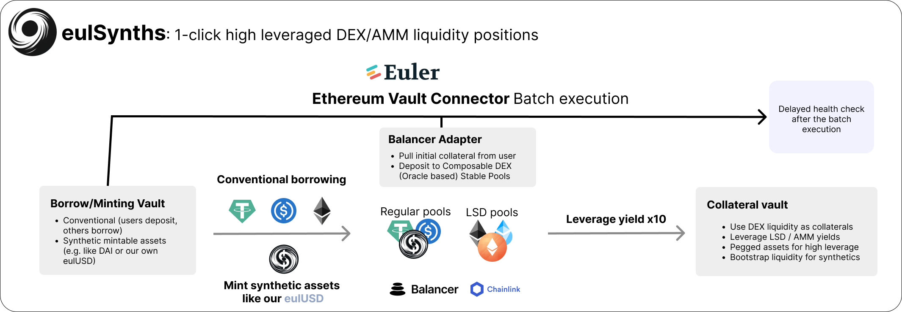

# eulSynth - Single click leveraged DEX LP

Open positions now on https://eth-denver-eul-synths.vercel.app/

## Tagline

eulSynths is a universal DeFi yield product platform built on Euler and Balancer.

The protocol allows users to leverage DEX liquidity from protocols like Balancer to multiply their intrinsic yield. This has applications across multiple domains:
- On top of LSD yields, they can also leverage their DEX yield exposure.
- The architecture allows for native minting of synthetic assets together with direct liquidity bootstrapping via Balancer's Composable Stable Pools.
- All of this is enabled by Euler's Ethereum Vault Connector - the batch and deferred health check allow for single-click execution of leveraged AMM pools without looping.

## What problems do we solve

Getting optimal yield has been very difficult in the past. A multitude of synthetic assets and derivatives (especially LSDs) allow for multiple variations of generating income.

One could either add them to DEX pools to earn fees on the high volumes or leverage them on lending protocols.
eulSynth is the first protocol that allows for flexible and dynamic onboarding of DEX liquidity.

## Challenges

Balancer and Euler are both highly composable protocols, however, their composability comes with a high degree of complexity.

Balancer for instance allowed us to select from a multitude of Stable Pools, each of which have highly specific parameterizations. On top of that, Euler's implementation of the Vault Connector is entirely new, as such, we had to take a long time to even just understand how we could make them work together.

## Technologies 

- Synthetic assets enabled by Chainlink's price feeds.
- Balancer's Composable Stable Pools (which are also oracle-based).
- Euler's Ethereum Vault Connector that allows for flexible batching and single-click leveraged Balancer DEX liquidity provision.

## Contracts
The contracts are deployed on Ethereum Sepolia testnet.

| Contract    | Address | Description |
| -------- | ------- | ------- |
| BalancerAdapterSepolia  | `0x3046ff18D6D0726BC9711E29DAE3A20F7C33de98` | Deploys balancer stable pool and is used for interactions with balancer, such as adding liquidity. |
| 3USD plus eulUSD CSP| `0x5a9676311a41e8acae9e2f46c1b5c4a304c38736`| Balancer pool token, used as underlying asset in the VaultCollateral. |
| VaultCollateral | `0xCe434378adacC51d54312c872113D687Ac19B516`     | Simple collateral vault which uses the balancer pool token as underlying asset. |
| VaultMintable    | `0x782FCEf760286f91e8466740a77C0e00a487Ad38`    | Replaces existing borrow and repay logic with mint and burn to enable issurance of synthetic assets. |
| EVC   | `0xA347d56A33Ea46E8dCAF2Ce2De57087f8f171Bd6`    |  Euler's Ethereum Vault Connector facilitates communication between ERC-4626 vaults. |
| DAI    | `0xbBF92F1A64Ad4f0292e05fd8E690fA8B872f835b`    | ERC20 Token |
| USDC    | `0xB67881Af90F005BE8c7553793F89BDbb3FD7448f`    | ERC20 Token |
| eulUSD    | `0x9f5E877f7a03f50C0319a6E15289283d6a8AC2E3`    | Synthetic ERC20 Token which is minted by the VaultMintable contract on borrow. |

## Smart Contract Testing
The contract tests were implemented with forge. To run the tests, move into the contracts folder with `cd contracts`. Run all tests with `forge test -vv`. To run a specific test, use the command `forge test -vv --match-contract <contract_name>`.

| Test File    | Description |
| -------- | ------- |
| BalancerAdapter.t.sol | Tests quoting and pricing.  |
| BalancerCreate.t.sol | Tests stable pool creation. |
| Batching.t.sol | Tests batching of deposit (with BalancerAdapter) and borrow to leverage LP. |
| SynthDeployer.t.sol   | Deploys contracts and leverages LP position. |
| SynthDeployerSepolia.t.sol   |  Deploys contracts with configuration for Ethereum Sepolia testnet and leverages LP position. |
| VaultMintable.t.sol | Tests borrow (mint) and repay (burn) functions of the vault. |

## How does it fit into DeFI

eulSynths unites the most complex DeFi projects to a set of easy-to-use yield products. 
- Our platform allows for high leverages on any tokenized DEX/AMM liquidity that leaves regular LSD staking APRs in the dust.
- We allow the creation of synthetic assets in a decentralized manner that instantly bootstraps deep on-chain liquidity - We can onboard any assets like eulUSD (as in our MVP), eulLTC and eulDOGE.

## How does it leverage ChainLink

eulSynths leverages ChainLink oracles in multiple ways.
- First off, it does so in the form of Composable Stable Pools, which are high-performance AMMs that rely on oracle swap rates. Due to their excellent impermanent loss metrics they are the ideal fit for leveraged yield farming.
- Secondly, we allow the minting of synthetic assets in such a manner that it natively provides instant, bootstrapped leveraged liquidity.

## How it leverages Euler

eulSynths provides the first working MVP of a Euler-native synthetic stablecoin. 

Conceptually this is easy to extend to any asset by just using a specific rate provider (e.g. Chainlink's LTC-USD feed) to issue other synthetic assets (e.g. eulLTC).

This is done by defining a vault that allows for minting and burning as borrow and repay mechanic and stabilazation of on-chain swaps through Balancer's Composed Stable Pools (CSPs).

Obviously one could also just use a regular borrow compatible vault (VaultRegularBorrowable already does that) for something like WETH or ETH and then use the BalancerAdapter to leverage the wstETH/ETH liquidity of Balancer by 10x.

The deferred health check allows to facilitate this fairly efficiently:
- We can do only one-time pool creation and supply the initial deposit and borrowed amount in one function call.
- The entire stack can be executed with one approval and one batch call. This could be broken down more with using EIP712, using an off-chain signature for the approval.
